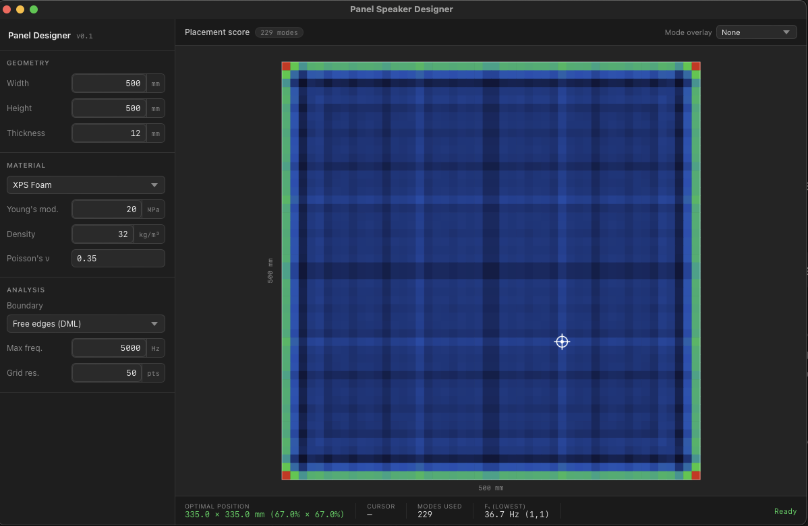

# Panel Speaker Designer

A native desktop app for calculating the optimal transducer position on a rectangular flat-panel (DML) speaker.

Built with [Tauri 2](https://tauri.app) — Rust backend, TypeScript/Canvas frontend. Builds natively on macOS, Windows, and Linux.

---

## What it does

Distributed Mode Loudspeaker (DML) panels work by exciting as many resonant modes as possible across a flat panel. Where you mount the exciter determines which modes get driven — place it on a node line of a given mode and that mode contributes nothing to the output.

This tool calculates the plate mode shapes analytically and scores every possible exciter position by how well it couples to all modes below a chosen frequency. The result is a heat map showing good (warm) and bad (cool) positions, with the optimal position marked.



---

## Physics

For a rectangular isotropic plate, mode frequencies follow the thin-plate dispersion relation:

```
f_mn = (1/2π) · √(D/ρh) · ((mπ/Lx)² + (nπ/Ly)²)
```

where `D = Eh³ / 12(1−ν²)` is the bending stiffness.

**Free edges (DML):** mode shapes approximated as `cos(mπx/Lx) · cos(nπy/Ly)` — the standard analytical approach used in DML research. Rigid-body modes (m+n < 2) are excluded. The optimal position search excludes a 10% edge margin, since corners are trivially at maximum amplitude for every cosine mode and are impractical mounting locations.

**Simply supported:** mode shapes are `sin(mπx/Lx) · sin(nπy/Ly)`, modes start at (1,1).

The placement score at a point is the sum of `|mode_shape(x,y)|` across all modes below the chosen frequency cutoff.

---

## Features

- **7 material presets** — XPS foam, EPS foam, balsa, birch plywood, acrylic, aluminium, carbon fibre — with E / ρ / ν fields that auto-fill and remain editable
- **Both boundary conditions** — free edges (realistic for DML) and simply supported
- **Heat map** — colour-coded placement score rendered on a proportional canvas, updates live as you change parameters
- **Mode node-line overlay** — select any mode from the dropdown to see its node lines drawn on the panel
- **Hover inspection** — move the cursor over the panel to read the score at any position

---

## Requirements

- [Rust](https://rustup.rs) (stable)
- Node.js 18+
- macOS 11+, Windows 10+, or a modern Linux desktop

---

## Development

```bash
# Install frontend dependencies
npm install

# Run in dev mode — hot-reloads HTML/CSS/TS, recompiles Rust on change
npm run tauri dev

# Build a release .app bundle
npm run tauri build
```

---

## Roadmap

| Phase | Status | Scope |
|---|---|---|
| 1 — Analytical | **Done** | Rectangular panel, isotropic material, placement heat map |
| 2 — Modal density | Planned | Modes-per-octave plot, frequency coverage score |
| 3 — Simple FEA | Planned | Non-rectangular geometry via Gmsh + SfePy |
| 4 — Full FEA | Planned | Stiffeners, cutouts, anisotropic materials via FEniCSx |

FEA phases will use a Python sidecar process, keeping the same interface.

---

## Reference

The physics and design rationale behind this tool are documented in [`docs/panel-speaker-lesson.md`](docs/panel-speaker-lesson.md).
