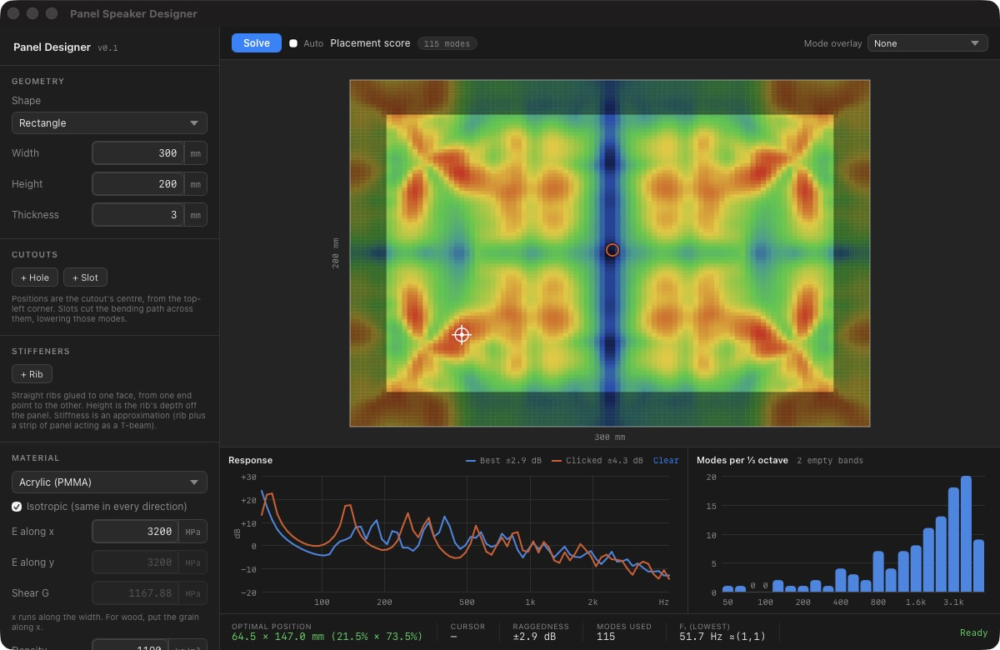

# Panel Speaker Designer

A native desktop app for calculating the optimal transducer position on a rectangular flat-panel (DML) speaker.

Built with [Tauri 2](https://tauri.app) — Rust backend, TypeScript/Canvas frontend. Builds natively on macOS, Windows, and Linux.

---

## What it does

Distributed Mode Loudspeaker (DML) panels work by exciting as many resonant modes as possible across a flat panel. Where you mount the exciter determines which modes get driven — place it on a node line of a given mode and that mode contributes nothing to the output.

This tool calculates the plate mode shapes analytically and scores every possible exciter position by how well it couples to all modes below a chosen frequency. The result is a heat map showing good (warm) and bad (cool) positions, with the optimal position marked.



---

## Physics

The panel is a thin (Kirchhoff) plate of orthotropic material: stiffness can differ along the width (`E_x`, e.g. along the grain) and height (`E_y`), with shear modulus `G` controlling twisting. Isotropic materials are the special case `E_x = E_y`, `G = E/2(1+ν)`.

**Free edges (DML):** mode shapes and frequencies come from a Rayleigh-Ritz solution using Legendre polynomials. This gives the true free-edge modes, including their larger motion near the edges, rather than the common `cos·cos` approximation, which misplaces free-edge frequencies by up to ~2× (and much more for wood). Results match Leissa's published values for a free square plate to within 0.5%. Rigid-body modes are excluded.

**Simply supported:** exact `sin(mπx/Lx) · sin(nπy/Ly)` shapes with the orthotropic frequency formula.

**Other shapes (FEA):** the outline is meshed into triangles and solved with DKT thin-plate elements and a sparse eigen-solver, all in Rust. The mesh is sized from the frequency range (five elements per half-wavelength), giving about 1–2% frequency error at the top of the band. Verified against the rectangle solver, the exact simply-supported solution, and Leissa's values for a free circular plate.

**Coupling:** an exciter drives the panel around its voice-coil ring, so its coupling to each mode is the mode shape averaged around that ring.

**Response and placement score:** from the couplings, the damped modal response gives the panel's average vibration level across frequency (in 1/12-octave bands, with the loss factor η setting damping). Placement is scored by *raggedness*: how far the response wanders, in dB RMS, from its own octave-smoothed trend. The overall slope is set by the panel; peaks and dips are what exciter position controls. The older score (sum of `|coupling|`) is still available. This is a vibration measure, not radiated sound pressure. The search excludes a 10% edge margin, since free edges move far more than anywhere practical to mount an exciter, and the heat map's colour scale is set by the interior for the same reason.

---

## Features

- **7 material presets** — XPS foam, EPS foam, balsa, birch plywood, acrylic, aluminium, carbon fibre — with fields that auto-fill and remain editable; balsa and plywood are orthotropic (grain along the width)
- **Exciter size** — voice-coil diameter, which averages out modes smaller than the coil
- **Panel shapes** — rectangle (exact solver), plus rounded rectangle, ellipse/circle, regular polygon and custom Bézier outlines drawn on the panel view (finite-element analysis)
- **Cutouts** — round holes and slots (any angle); slots cut the bending path across them, lowering those modes and adding modal density
- **Stiffeners** — straight ribs glued to one face, like a violin's bass bar; they stiffen the panel along their length and redistribute the modes
- **Both boundary conditions** — free edges (realistic for DML) and simply supported
- **Heat map** — colour-coded placement score rendered on a proportional canvas, updates live as you change parameters
- **Response chart** — predicted response at the best position; click anywhere on the panel to compare that position
- **Modal density** — modes per ⅓ octave, with empty bands flagged
- **Mode node-line overlay** — select any mode from the dropdown to see its node lines drawn on the panel
- **Hover inspection** — move the cursor over the panel to read the score at any position

---

## Requirements

- [Rust](https://rustup.rs) (stable)
- Node.js 18+
- macOS 11+, Windows 10+, or a modern Linux desktop

---

## Development

```bash
# Install frontend dependencies
npm install

# Run in dev mode — hot-reloads HTML/CSS/TS, recompiles Rust on change
npm run tauri dev

# Build a release .app bundle
npm run tauri build
```

---

## Roadmap

| Phase | Status | Scope |
|---|---|---|
| 1 — Analytical | **Done** | Rectangular panel, placement heat map |
| A — Accurate modes | **Done** | Rayleigh-Ritz free-edge modes, orthotropic materials, exciter footprint |
| B — Response scoring | **Done** | Damped modal response; score placement by flatness; modes-per-octave plot |
| C — Calibration | Planned | Fit stiffness to tap-test frequencies; overlay REW measurements |
| D1 — FEA engine | **Done** | Native Rust FEA (DKT elements, sparse eigen-solver); rounded-rectangle, ellipse/circle and polygon panels |
| D2 — Cutouts | **Done** | Round holes and rounded-end slots at any angle |
| D3 — Stiffeners | **Done** | Straight ribs glued to one face (spruce, carbon, aluminium or panel material) |
| D4 — Custom outlines | **Done** | Bézier outline editor on the panel view |
| E — Radiation | Optional | Baffled-panel SPL estimate via the Rayleigh integral |

The original plan (separate SfePy and FEniCSx phases via a Python sidecar) was replaced by one native Rust FEA solver. Calibration (C) is waiting on a physical panel to measure.

---

## Reference

The physics and design rationale behind this tool are documented in [`docs/panel-speaker-lesson.md`](docs/panel-speaker-lesson.md).
